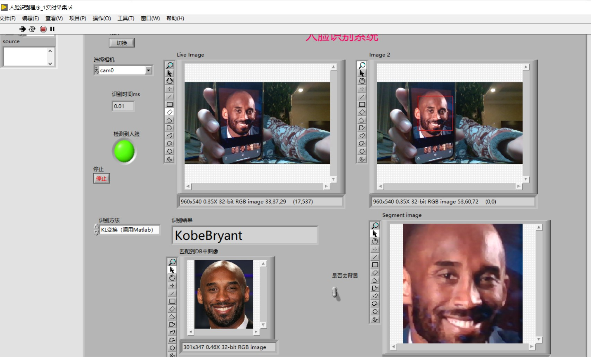

# Realtime Face Recognition in Labview

author LokiXun  2682414501@qq.com



> [FaceDetection Blog reference](https://blog.csdn.net/weilixin88/article/details/103392246?spm=1001.2014.3001.5501)
>
> - Labview 与 Matlab 接口实现
>   [参考1](https://forums.ni.com/t5/NI-LabVIEW-CVI-%E6%95%B0%E6%8D%AE%E9%87%87%E9%9B%86%E7%AD%89%E4%BA%A7%E5%93%81%E8%AE%A8%E8%AE%BA%E5%8C%BA/labview%E4%B8%8Ematlab%E7%9A%84%E6%8E%A5%E5%8F%A3%E5%AE%9E%E7%8E%B0/td-p/712532?profile.language=zh-CN)  [Matlab Script 的使用](https://www.ilovematlab.com/thread-52086-1-1.html)

## usage

- Program Entry

  ````
  FaceRecognition_realtime_detection_usingPCA.vi
  ````

## Database Preparation

- prepare person facial photos
  prepare each person's face image in the directory `.\Face_Database\Name` by person's name.

- generate faces' eigenvectors of each photo
  run `.\FaceDB_Generate_Matlab\FaceRecognitionPCA_generate_DB_eigenvector.m` to generate Face's eigenvector, and saved in mat file `.\FaceDB_Generate_Matlab\FaceDetect_DB_23_2_9.mat`

## setup

- [Labview setup](https://mp.weixin.qq.com/s/CMT-yr1Y4F8wUzteQMoJ8w)
- Matlab version > 2018
- setup Labview's OpenCV Face Detection Module


# Q&A

1. [vision opencv库 dll文件找不到](https://knowledge.ni.com/KnowledgeArticleDetails?id=kA03q000001DkgxCAC&l=zh-CN)

> 现在 PC 上的 Labview 是 32 bit 的！！

2. [使用MATLAB®脚本节点时遇到错误1047](https://knowledge.ni.com/KnowledgeArticleDetails?id=kA00Z0000019VJLSA2&l=zh-CN)
3. https://forums.ni.com/t5/kl3m3n-s-blog/Real-time-face-and-eye-detection-in-LabView-using-OpenCV-Harr/ba-p/3486952?profile.language=zh-CN

3. Unable to run properly
   
   - have matlab interactive error, like unable to use matlab script in Labview
     close both the Labview and matlab. Restart the matlab first, and start labview after matlab under fully running! 
   
     > Note: the restart sequence matters!
   
   - could not detect the face region :fire:
     库文件运行异常》运行安装目录下的例程 `E:\Labview2017\examples\Vision\NIVision OpenCV Utilities\OpenCV Face Detection.vi`
   


## Details

- PCA feature extraction

  1. Transform to gray scale image
  2. resize to [200, 200] & reshape to [200x200, 1] put as columns vectors into `matrix T`
  3. compute mean column vector in `matrix T` & each vectors  minus mean vectors to get centric matrix `A`

  

- `rgb2gray`

  Change from RGB space to `YUV` or `YCbCr` color space and use Y value as gray-scale image.

  `rgb2gray` 通过计算 R、G 和 B 分量的加权和，将 RGB 值转换为灰度值: $0.2989 * R + 0.5870 * G + 0.1140 * B $

  - YUV space 

    mainly consider the simplicity to transform the color space, which usually used be compatible  Black&White TV.
    $$
    Y = 0.2989 * R + 0.5870 * G + 0.1140 * B \\
    U = B - Y \\
    V = R - Y \\
    where~Y~is~brightness,~U,V~is~color~difference.
    $$

   Similarly, Y value in `YCbCr` Space is also computed by this equation, denotes the brightness.

  
